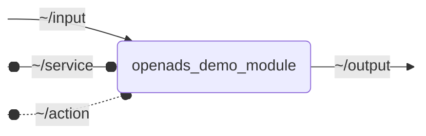

# `openads_demo_module`

ROS 2 C++ package template for OpenADS

- [Container Images](#container-images)
- [openads_demo_module](#openads_demo_module)

### Container Images

| Description | Image:Tag | Default Command |
| --- | --- | -- |
|  |  |  |

## Nodes

### `openads_demo_module`

#### Subscribed Topics

| Topic | Type | Description |
| --- | --- | --- |
| `~/input` | `geometry_msgs/msg/PointStamped` | Demo input topic |

#### Published Topics

| Topic | Type | Description |
| --- | --- | --- |
| `~/output` | `geometry_msgs/msg/PointStamped` | Demo output topic |

#### Service Servers

| Service | Type | Description |
| --- | --- | --- |
| `~/service` | `std_srvs/srv/SetBool` | Demo service |

#### Action Servers

| Action | Type | Description |
| --- | --- | --- |
| `~/action` | `openads_demo_module_interfaces/action/Fibonacci` | Demo action |

#### Parameters

| Parameter | Type | Default | Description |
| --- | --- | --- | --- |
| `param` | `float` | `1.0` | Demo parameter |

## Launch Files

### [`openads_demo_module_launch.py`](launch/openads_demo_module_launch.py)

| Argument | Default | Description |
| --- | --- | --- |
| `input_topic` | `"~/input"` | Demo input topic |
| `output_topic` | `"~/output"` | Demo output topic |
| `service_topic` | `"~/service"` | Demo service |
| `name` | `"openads_demo_module"` | node name |
| `namespace` | `""` | node namespace |
| `params` | `os.path.join(get_package_share_directory("openads_demo_module"), "config", "params.yml")` | path to parameter file |
| `log_level` | `"info"` | ROS logging level (debug, info, warn, error, fatal) |
| `use_sim_time` | `"false"` | use simulation clock |
