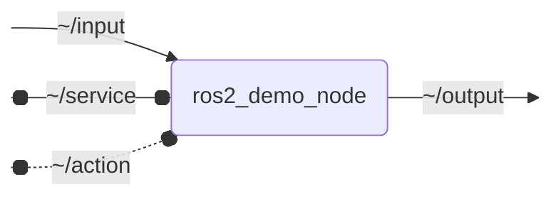

# `ros2_demo_package`

TODO

## Nodes

### `ros2_demo_node`

#### Subscribed Topics

| Topic | Type | Description |
| --- | --- | --- |
| `~/input` | `geometry_msgs/msg/PointStamped` | TODO |

#### Published Topics

| Topic | Type | Description |
| --- | --- | --- |
| `~/output` | `geometry_msgs/msg/PointStamped` | TODO |

#### Service Servers

| Service | Type | Description |
| --- | --- | --- |
| `~/service` | `std_srvs/srv/SetBool` | TODO |

#### Action Servers

| Action | Type | Description |
| --- | --- | --- |
| `~/action` | `ros2_demo_package_interfaces/action/Fibonacci` | TODO |

#### Parameters

| Parameter | Type | Default | Description |
| --- | --- | --- | --- |
| `param` | `float` | `1.0` | TODO |

## Launch Files

### [`ros2_demo_node_launch.py`](launch/ros2_demo_node_launch.py)

| Argument | Default | Description |
| --- | --- | --- |
| `input_topic` | `"~/input"` | input topic |
| `output_topic` | `"~/output"` | output topic |
| `service` | `"~/service"` | service topic |
| `name` | `"ros2_demo_node"` | node name |
| `namespace` | `""` | node namespace |
| `params` | `os.path.join(get_package_share_directory("ros2_demo_package"), "config", "params.yml")` | parameter file |
| `log_level` | `"info"` | ros logging level |
| `use_sim_time` | `"false"` | use simulation time |
